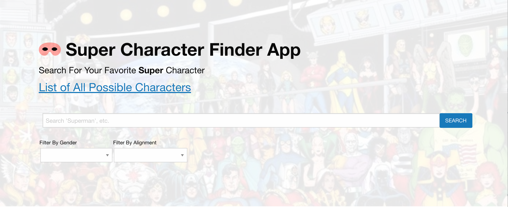
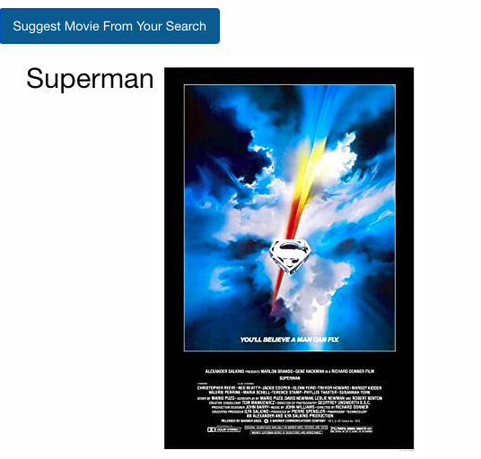
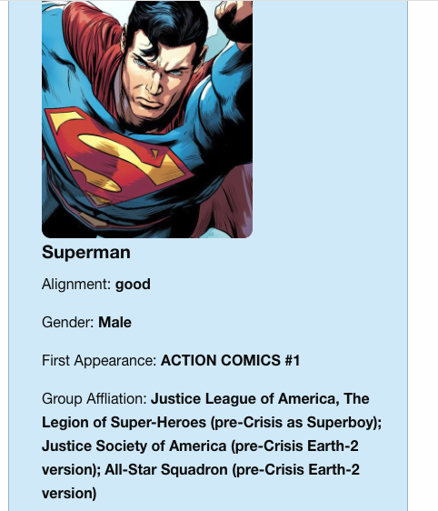
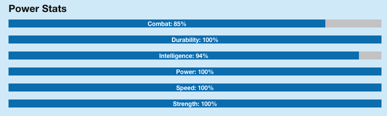

# Super Character Finder App
Built Using Superhero API, OMDb API for Movie Suggestion, Foundation Framework, &amp; Font-Awesome.

## Live Github Page: https://jeremyredkey.github.io/characterfinder/ 

## Motivation

Wanted to make an application that would make someone that doesn't know super characters they could find more information quickly.

## What Does The App Do?

Not only does it search for a wide variety of super characters but gives a card with a general overview of information about every super character. 

As a additional feature at the bottom of the page too it allows for user to get a movie suggestion based on what they searched.

## Screenshots of App

Landing Page With Full Search and Filter Dropdowns:

Movie Suggestion Feature:

Search Results Character Card:

Character Power Stats:

## Technologies Used for this Project
Built Using HTML, CSS, JavaScript, JQuery, Superhero API, OMDb API for Movie Suggestion, Foundation Framework, &amp; Font-Awesome 6.

## License
[MIT](https://choosealicense.com/licenses/mit/)
